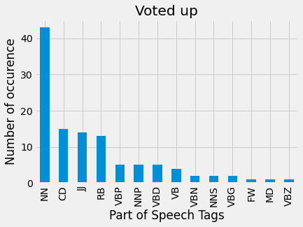
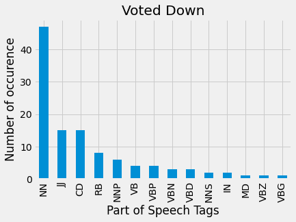
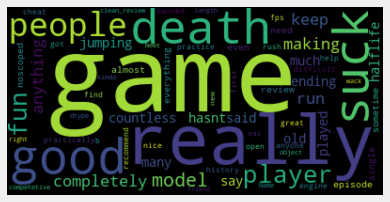
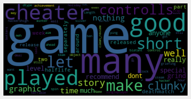

# Classifying Reviews and Recommending Games on Steam 

**Authors:** Elliott Iturbe,  Jacob Hoogstra, Griffin Riner

## Overview
The goal of this project is to create an NLP model that can predict if a user would like or not like a game and then combine a recommendation system to the NLP model. In order to give recommendations to the client on games they would like based off the review they created for the previous game.

## Business Problem
We set out to make it easier for Users to determing what game to play based off of review they wrote for a previous game that our  NLP model runs and then passes to our recommendation system which recommends games the user would be intrested in.

## Data
We examined data on Steam Reviews for video games, data included steamid, appid, app_title, app_tags, review, fps, voted_up, clean_review. Depending on our diffrent phase of the project diffrent features where selected for our recommendation system: add title and app tags were used but for our NLP models all feature were used.

## Methods
Our process started with organizing our data by combining and minipulating dataframes in order to creating a new one usable one. Data for our NLP was then vectorized and then train test split and ran through muliple models until eventually we came to a conclusion for MultinomialNB model to be used. As for recommendation system sorting by specific values, and merging dataframes. While modeling our data, we used descriptive statistics to create helpful visuals that displayed our findings. Overall, our descriptive analysis is absolutely essential for anyone who wants to succeed in the movie industry.

## Results

This visualization shows The Parts of Speech(POS) Tagging in Python’s NLTK library for the positive votes.



This is a visual of The Parts of Speech(POS) Tagging in Python’s NLTK library for the negative votes.



This WordCloud shows the most frequent words in the sample taken for positive reviews.


This WordCloud shows the most frequent words in the sample taken for negative reviews.




## Conclusions
Using our models, Steam would be able to create recommendations based on their user’s reviews. This would help them tailor their recommendations to their user’s based on games they like and dislike.

## Next Steps
This project used a premade data set that was flawed with duplicates and multiple games with not many reviews and one or two games with numerous reviews. So we would want to create our own dataset with the use of an Api call or wepscraping with no duplicates and ability to control to amount of reviews. As well as we would need to use AWS instead of working locally in order to use the large amounts of data we had instead of using samples of the data in order to work on the data locally. 


## For More Information
Please review our full analysis in [our EDA Jupyter Notebook](./Chapter1_EDA_prep.ipynb), [our NLP Jupyter Notebook](./Chapter2_NLP.ipynb), [our Recommendation Jupyter Notebook](./Chapter3_Recommend.ipynb) or our [presentation](./Steam Reviews Sentiment and Recommendations.pdf).

For any additional questions, please contact **Elliott Iturbe at eaiturbe@bsc.edu, Jacon Hoogstra at jnhoogstra@crimson.ua.edu, or Griffin Riner at gnriner@bsc.edu**

## Repository Structure

```
├── Notebooks                                         <- code written for project with explanation
├── data                                              <- data files used for analyses
├── deployment                                        <- code written for web application deployment 
├── images                                            <- visualizations created
├── Steam Reviews Sentiment and Recommendations.pdf   <- PDF version of powerpoint
└── README.md                                         <- overview of project
```

